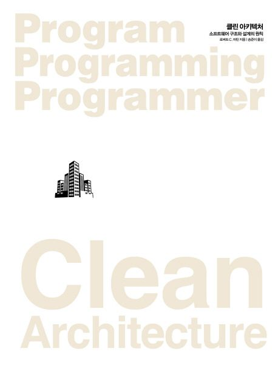

# 클린 아키텍처: 소프트웨어 구조와 설계의 원칙

## Overview

- [교보문고](https://product.kyobobook.co.kr/detail/S000001033082)

## OT

- 전체 기간
  - 최대 두 달 예상?
  - 늦어도 4월 초에 마무리 예상, 8주 정도
- 진도
  - 시작은 1부 정리하는 걸로
  - 1부는 가볍게 궁금한 점만 짚어보고 가고, 2부부터는 발표 순서 정해서 진행하는 방향으로
- 일정
  - 다음 스터디는 **2월 19일 오후 4시**쯤
  - 스터디 일정은 서로 재택하는 날짜가 하루 밖에 없고 유동이 많아서, **스터디 진행 날에, 다음 스터디 일자를 잡는 방향으로**
  - 만약 저녁에 한다면? 출근한 날의 경우 오후 9시 이후가 편함 (서로)

## 진도

|    date    | time  |    chapters    | speakers |
| :--------: | :---: | :------------: | :------: |
| 2024-02-19 | 16:00 |      1, 2      |   all    |
| 2024-02-28 | 16:00 |    3,4,5,6     |   all    |
| 2024-03-06 | 21:10 | 7,8,9,10,11,12 |   all    |
| 2024-03-?? |  ??   |     13,14      |   all    |

## Chapters

- [1장. 설계와 아키텍처란?](./chapter01/)
- [2장. 두 가지 가치에 대한 이야기](./chapter02/)
- [3장. 패러다임 개요](./chapter03/)
- [4장. 구조적 프로그래밍](./chapter04/)
- [5장. 객체 지향 프로그래밍](./chapter05/)
- [6장. 함수형 프로그래밍](./chapter06/)
- [7장. SRP: 단일 책임 원칙](./chapter07/)
- [8장. OCP: 개방-폐쇄 원칙](./chapter08/)
- [9장. LSP: 리스코프 치환 원칙](./chapter09/)
- [10장. ISP: 인터페이스 분리 원칙](./chapter10/)
- [11장. DIP: 의존성 역전 원칙](./chapter11/)
- [12장. 컴포넌트](./chapter12/)
